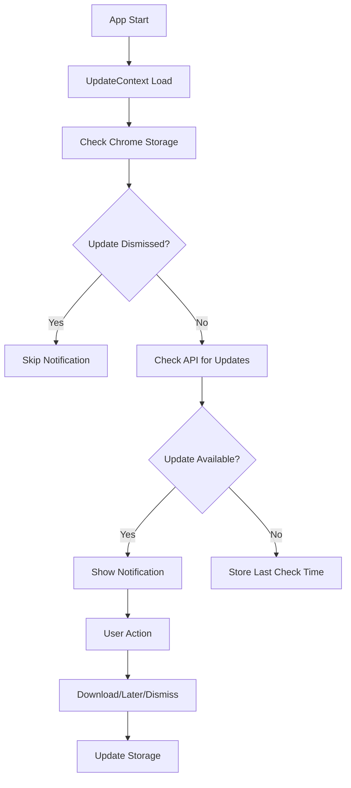

# 🔄 LinkedIn CRM Update System Documentation

## Overzicht

Het LinkedIn CRM Update System zorgt ervoor dat gebruikers automatisch worden geïnformeerd over nieuwe versies van de extensie. Het systeem is volledig geautomatiseerd en gebruiksvriendelijk.

---

## 🏗️ **Architectuur**

### **Backend Componenten**
- **`/api/version` endpoint**: Versie vergelijking en update informatie
- **Version checking logic**: Vergelijkt huidige vs. laatste versie
- **Release notes**: Dynamische release informatie per versie
- **CORS support**: Proper headers voor Chrome extensie

### **Frontend Componenten**
- **`UpdateContext`**: State management voor updates
- **`UpdateNotification`**: UI component voor update notificaties
- **`SettingsView`**: Update informatie in instellingen
- **Chrome Storage**: Persistent storage voor update preferences

---

## 🔧 **Technische Implementatie**

### **1. Backend API (`/api/version`)**

```typescript
GET /api/version?version=1.0.0

Response:
{
  "latest": "1.1.0",
  "current": "1.0.0",
  "updateAvailable": true,
  "updateType": "minor",
  "releaseNotes": "Nieuwe functies toegevoegd in versie 1.1.0",
  "downloadUrl": "https://github.com/.../releases/latest",
  "features": ["Dark mode", "Export functies"],
  "bugFixes": ["Performance verbeteringen"],
  "breakingChanges": []
}
```

**Update Types:**
- **Major** (🚀): Nieuwe hoofdversie met breaking changes
- **Minor** (✨): Nieuwe functies toegevoegd
- **Patch** (🔧): Bugfixes en verbeteringen

### **2. Frontend Update Flow**



---

## 📱 **Gebruikerservaring**

### **Update Notification Banner**
- **Visueel**: Mooie geanimeerde banner met LinkedIn kleuren
- **Informatief**: Toont update type, versie, en nieuwe functies
- **Acties**: Download knop en "Later" optie
- **Dismissal**: Smart dismissal per versie

### **Settings Integration**
- **Huidige versie**: Toont actuele versie nummer
- **Update status**: Visuele indicator voor beschikbare updates
- **Handmatige check**: Knop om updates handmatig te controleren
- **Update details**: Uitgebreide informatie over nieuwe versies

---

## ⚙️ **Configuratie**

### **Automatische Checks**
- **App start**: 3 seconden vertraging na login
- **Periodiek**: Elke 24 uur automatische check
- **Manual**: Via settings knop

### **Storage Management**
```typescript
// Chrome Storage Keys
{
  "updateInfo": VersionInfo,
  "lastUpdateCheck": timestamp,
  "dismissedVersion": "1.1.0",
  "updateDismissed": boolean
}
```

### **Caching Strategy**
- **API Response**: 5 minuten cache
- **Update Info**: Persistent in Chrome storage
- **Dismissal State**: Per versie opgeslagen

---

## 🚀 **Release Proces**

### **1. Nieuwe Versie Voorbereiden**
```bash
# Update manifest.json versie
"version": "1.1.0"

# Update backend version endpoint
const latestVersion = '1.1.0';

# Voeg release notes toe
versionInfo.features = [
  'Dark mode toggle',
  'Advanced filtering',
  'Export to CSV'
];
```

### **2. Backend Deployment**
```bash
# Commit en push naar develop
git add .
git commit -m "feat: release v1.1.0 with dark mode"
git push origin develop

# Vercel deployt automatisch
# /api/version endpoint wordt bijgewerkt
```

### **3. Extension Package**
```bash
# Build UI
cd linkedin-crm-extension/ui
npm run build

# Maak nieuwe zip
cd ..
zip -r linkedin-crm-extension-v1.1.0.zip linkedin-crm-extension/
```

### **4. Distributie**
- Upload zip naar GitHub Releases
- Update downloadUrl in version endpoint
- Gebruikers krijgen automatische notificatie

---

## 📊 **Monitoring & Analytics**

### **Update Metrics**
- **Check Frequency**: Hoe vaak gebruikers checken op updates
- **Download Rate**: Percentage gebruikers die updates downloaden
- **Dismissal Rate**: Percentage gebruikers die updates negeren
- **Version Distribution**: Welke versies actief gebruikt worden

### **Error Handling**
- **Network Errors**: Graceful fallback, geen crashes
- **API Failures**: Silent failure, probeer later opnieuw
- **Storage Errors**: Fallback naar memory state
- **Version Parsing**: Robust version comparison

---

## 🔒 **Security & Privacy**

### **Data Collection**
- **Minimaal**: Alleen versie nummer wordt verzonden
- **Geen PII**: Geen persoonlijke informatie
- **Lokaal**: Update preferences opgeslagen lokaal

### **API Security**
- **CORS**: Proper headers voor Chrome extensie
- **Rate Limiting**: Voorkom spam requests
- **Caching**: Reduce server load
- **Validation**: Input validation voor versie strings

---

## 🛠️ **Troubleshooting**

### **Veelvoorkomende Issues**

**1. Update notificatie verschijnt niet**
- Check of API endpoint bereikbaar is
- Verificeer versie nummer in manifest.json
- Controleer Chrome storage voor dismissed updates

**2. Download link werkt niet**
- Update downloadUrl in version endpoint
- Verificeer GitHub release bestaat
- Check URL formatting

**3. Notificatie blijft verschijnen**
- Clear Chrome storage voor extension
- Check dismissedVersion in storage
- Verificeer version comparison logic

### **Debug Commands**
```javascript
// In Chrome DevTools Console
// Check current version
chrome.storage.local.get(['updateInfo'], console.log);

// Clear update state
chrome.storage.local.clear();

// Manual update check
// (Via Settings > Updates > Controleer updates)
```

---

## 🔮 **Toekomstige Verbeteringen**

### **Geplande Features**
- **Auto-update**: Automatische installatie van updates
- **Update scheduling**: Geplande update installaties
- **Rollback**: Terugdraaien naar vorige versie
- **Beta channel**: Test versies voor power users
- **Update analytics**: Gedetailleerde gebruikersstatistieken

### **Technical Improvements**
- **Service Worker**: Background update checking
- **Push notifications**: Real-time update alerts
- **Delta updates**: Alleen gewijzigde bestanden
- **Signature verification**: Update authenticity checks

---

## 📞 **Support**

Voor vragen over het update systeem:
- **GitHub Issues**: Technical problems
- **Help Page**: Ingebouwde documentatie
- **Settings**: Update informatie en controls

---

**Het update systeem zorgt ervoor dat gebruikers altijd de nieuwste versie hebben en op de hoogte blijven van nieuwe functies! 🚀**
